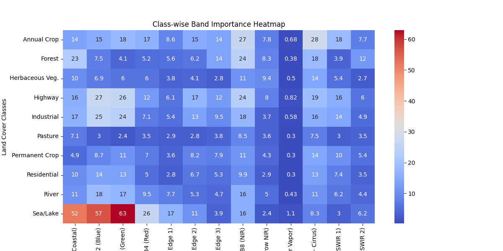

# Interpretable Deep Learning for Land Use and Land Cover (LULC) Classification

## Overview
This project is an **implementation and extension** of the research paper:  

**_"Interpretable Deep Learning Framework for Land Use and Land Cover Classification in Remote Sensing Using SHAP"_**  

The goal of this work is to build a **deep learning-based Land Use and Land Cover (LULC) classification model** for remote sensing images while ensuring **interpretability of predictions** using:  

- **SHAP (SHapley Additive exPlanations)** to identify feature contributions.  
- **Modified Perturbation Method** to visualize and quantify how changes in input affect predictions.  

By combining SHAP and perturbation analysis, this framework allows users to **understand why the model predicts certain land cover types**, increasing **trust and explainability** in geospatial AI systems.

---

## Key Features
- **Deep Learning for LULC Classification** using remote sensing data.  
- **SHAP Analysis** for pixel-level and feature-level interpretability.  
- **Modified Perturbation Method** to measure model sensitivity to input changes.  
- **Combined Explainability** for improved model transparency and decision support.  

---

## Methodology
1. **Model Training**  
   - Trained a CNN-based model to classify land use and land cover categories from remote sensing imagery.  
2. **SHAP Analysis**  
   - Computed **SHAP value maps** to highlight influential regions and spectral bands.  
3. **Modified Perturbation Method**  
   - Implemented a **perturbation-based interpretability approach** that analyzes prediction changes when specific pixels or regions are altered.  
   - Enhanced to provide **more robust and localized explanations**.  
4. **Integrated Interpretation**  
   - Combined insights from **SHAP and perturbation** to identify **critical spectral and spatial features** responsible for model decisions.

---

## Results
- **SHAP Maps:** Highlight regions most influential in model decisions.  
- **Perturbation Heatmaps:** Visualize model sensitivity to pixel/region changes.  
- **Class-Wise Feature Insights:** Identify the most critical spectral bands for different land cover types.  

Example Visualizations:

  
*Perturbation analysis highlighting the most sensitive areas for prediction changes.*

---

## References
Original Paper:  
> *Interpretable Deep Learning Framework for Land Use and Land Cover Classification in Remote Sensing Using SHAP*  

---

## Future Improvements
- Integrate **Grad-CAM** for multi-method interpretability comparison.  
- Extend to **Hyperspectral datasets** for enhanced LULC classification.  
- Experiment with **Custom CNN** architecture.

---

## Author
**S. M. Nafis Ahmed**  
AI Researcher | Computer Vision & LLM Enthusiast
